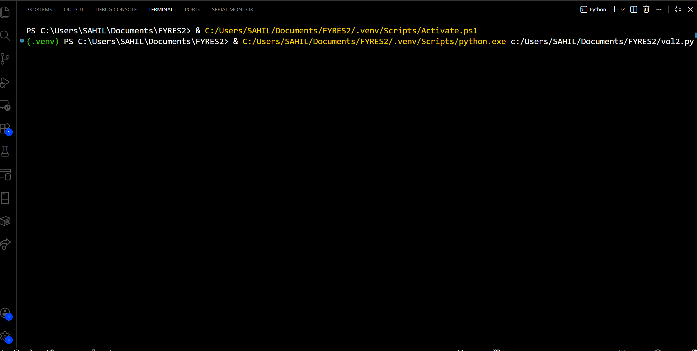

## Quant & Market Technology Stack

- **Python for systematic trading**
  - FastAPI + Uvicorn to run a low‑latency tick and candle engine.
  - Fyers WebSocket API (`fyers_apiv3.FyersDataSocket`) for live NSE NIFTY futures market data.
  - Custom tick handler to convert exchange **cumulative volume** into true **per‑tick volume**.
  - 1‑minute OHLCV **candle aggregation** from raw ticks using exchange timestamps.
  - Real‑time **order‑flow classification** (high‑notional BUY / SELL / NEUTRAL) using next‑tick price reaction.
  - Business‑level volume threshold based on **futures price × per‑tick volume** (notional traded per impulse).

- **Market microstructure & order‑flow modelling**
  - Focus on aggressive flow (trades at/near bid‑ask) rather than just end‑of‑bar data.
  - Design of a live **volume footprint / institutional prints** feed via markers at exact trade prices.
  - Use of configurable notional thresholds to approximate **institutional vs retail** participation.

- **Data engineering for trading**
  - PostgreSQL (via `psycopg2`) for **tick‑level storage** of NIFTY futures (timestamps, LTP, per‑tick volume, bid/ask, totals).
  - Batched inserts for write‑optimized tick ingestion (`MAX_BATCH_SIZE`).
  - Schema suitable for later **research, backtesting, and risk monitoring** on top of the same live data.

- **Real‑time infrastructure**
  - WebSocket broadcast layer (FastAPI `WebSocket` + custom connection manager) for pushing:
    - 1‑minute OHLCV candles.
    - High‑notional BUY/SELL markers `{time, price, volume, result}`.
  - Health and monitoring endpoints (`/`, `/health`) exposing live server, database, and data‑feed status.
 
  - ## 🎥 Live Backend Demo

